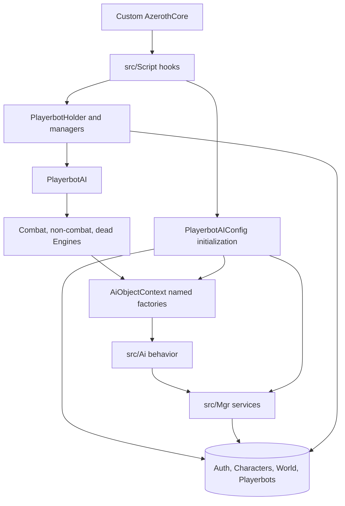

# Architecture overview

## System context

`mod-playerbots` is loaded as an AzerothCore module and depends on APIs added by the `Playerbot` branch of `mod-playerbots/azerothcore-wotlk`. The module is not an independent server and does not carry a standalone `CMakeLists.txt`. AzerothCore discovers the module sources and calls the loader exported by `src/Script/playerbots_loader.cpp`.

The custom core supplies important contracts that are consumed here, including playerbot script hooks, bot-aware world sessions, `PlayerbotsDatabase`, its prepared-statement namespace, packet hooks, and update hooks. When investigating behavior, the matching core branch is part of the effective codebase.

## High-level component model



## Architectural layers

### 1. Integration layer

Primary paths:

- `src/Script/playerbots_loader.cpp`
- `src/Script/Playerbots.cpp`
- `src/Script/PlayerbotCommandScript.cpp`
- `src/Script/PlayerbotsSecureLogin.cpp`
- `src/Script/WorldThr/`

This layer converts AzerothCore lifecycle, player, packet, battleground, battlefield, and database events into module operations. It is also where the world-thread operation queue is drained.

### 2. Lifecycle and ownership layer

Primary types:

- `PlayerbotHolder` in `src/Bot/PlayerbotMgr.h`
- `PlayerbotMgr` in `src/Bot/PlayerbotMgr.h`
- `PlayerbotsMgr` in `src/Bot/PlayerbotMgr.h`
- `RandomPlayerbotMgr` in `src/Bot/RandomPlayerbotMgr.h`
- `PlayerbotAI` in `src/Bot/PlayerbotAI.h`

This layer decides which characters can become bots, starts asynchronous logins, creates bot sessions, registers active bots, connects a bot to its master, schedules random population, and tears bots down.

The names are similar but responsibilities differ:

| Type | Cardinality | Owns or indexes |
|---|---:|---|
| `PlayerbotsMgr` | One process-wide singleton | GUID to `PlayerbotAI` and GUID to real-player `PlayerbotMgr` registries |
| `PlayerbotMgr` | One per real master player | Active alt bots controlled by that master |
| `RandomPlayerbotMgr` | One process-wide singleton | Active autonomous bot population and event schedule |
| `PlayerbotAI` | One per bot character | AI context, three engines, packet handlers, master relation |
| `PlayerbotHolder` | Base for the two holder types | Active bot map and common login/logout/session operations |

### 3. Decision engine layer

Primary path: `src/Bot/Engine/`

The engine is a string-keyed dependency graph:

- A `Strategy` declares default actions, trigger handlers, multipliers, and action-node relationships.
- A `Trigger` observes current state and emits an `Event` when active.
- An `Action` checks usefulness and possibility, then changes game state.
- A `Value<T>` exposes current or calculated state, often with caching.
- A `Multiplier` changes action relevance for a context or encounter.
- `AiObjectContext` resolves names to per-bot instances through shared creator registries.
- `Engine` prioritizes and executes candidates for one bot state.

See [`ai-engine.md`](ai-engine.md) for the full path.

### 4. Gameplay behavior layer

Primary paths:

- `src/Ai/Base/` for shared behavior
- `src/Ai/Class/` for class and specialization behavior
- `src/Ai/Raid/` and `src/Ai/Dungeon/` for instance mechanics
- `src/Ai/World/` for open-world and RPG behavior

These directories should depend on engine abstractions and service managers. Avoid placing general lifecycle or database ownership inside a single action or trigger.

### 5. Domain service layer

Primary path: `src/Mgr/`

Long-lived managers own travel graphs, equipment and random-item caches, guild state, text localization, talent helpers, movement support, and command security. `src/Db/` contains narrower persistence repositories.

### 6. Data and configuration layer

Primary paths:

- `conf/playerbots.conf.dist`
- `src/PlayerbotAIConfig.h`
- `src/PlayerbotAIConfig.cpp`
- `data/sql/`

Configuration is loaded into a process-wide object at startup. The module uses four database scopes and several caches. See [`data-and-configuration.md`](data-and-configuration.md).

## Dependency direction

Preferred direction:

```text
AzerothCore hook
  -> lifecycle owner or AI entry point
    -> engine abstraction or domain manager
      -> AzerothCore API and the correct database
```

Avoid these inversions:

- A low-level value initiating bot login or logout.
- A calculated value directly mutating groups, guilds, or sessions.
- An encounter strategy owning process-wide cache initialization.
- A manager reaching into another manager's private mutable container instead of using an established API.
- A map-thread action directly performing work that existing code defers to a world-thread operation.

## Control plane and data plane

The module has two related planes:

### Control plane

- Module and database initialization
- Bot account classification
- Bot login and logout
- Population scheduling
- Strategy activation and command handling
- World-thread operation dispatch

### Data plane

- Per-bot trigger and value evaluation
- Action selection and execution
- Movement and packet reactions
- Combat, quest, loot, social, and encounter behavior

Control-plane changes have broad lifetime and concurrency impact. Data-plane changes have broad performance impact because they can execute for every active bot.

## Extension seams

| Goal | Primary seam |
|---|---|
| Add general behavior | Base action, trigger, value, or strategy context |
| Add class behavior | `<Class>AiObjectContext` and class strategy files |
| Add encounter behavior | Raid or dungeon strategy plus action and trigger contexts |
| Add process-wide service | Existing `src/Mgr/` pattern plus explicit startup order |
| Add persistence | Correct database plus repository or manager and updater SQL |
| Add a chat command | Playerbot command action or command script with security checks |
| Add shared-world mutation | Concrete `PlayerbotOperation` queued to the world-thread processor |
| Add an operator setting | Config template, config field, loader, and validation |

## Cross-cutting risks

### Lifetime

Login and logout cross asynchronous database callbacks, fake sessions, map presence, holder maps, global registries, and player destruction. A raw `Player*` or `WorldSession*` must not be assumed valid after a queued or delayed boundary.

### Concurrency

`PlayerbotAI` updates happen through player map updates, while random population and queued operations run from world updates. Session update hooks form another integration path. Identify the current thread from the caller, not from the callee's name.

### Performance

A cheap-looking target scan or database call becomes expensive when multiplied by thousands of bots. Values should expose shared calculations, calculated values should use sensible refresh intervals, and actions should not repeat work already performed by triggers.

### String contracts

Named-object keys have no compiler-enforced linkage. A typo usually produces an unknown action, trigger, value, or missing strategy at runtime rather than a compile error.

### Derived data

Item, rarity, equipment, teleport, and travel tables can be authoritative, generated, or cached depending on the manager. Determine provenance before adding writes or migrations.

## Important source landmarks

- Script registration: `AddPlayerbotsScripts()` in `src/Script/Playerbots.cpp`
- Startup orchestration: `PlayerbotAIConfig::Initialize()` in `src/PlayerbotAIConfig.cpp`
- Human and bot update hooks: `PlayerbotsPlayerScript` in `src/Script/Playerbots.cpp`
- Global registries and holder model: `src/Bot/PlayerbotMgr.h`
- Random bot scheduling: `RandomPlayerbotMgr::UpdateAIInternal()` in `src/Bot/RandomPlayerbotMgr.cpp`
- AI construction: `AiFactory` in `src/Bot/Factory/AiFactory.cpp`
- Named context construction: `AiObjectContext::BuildAllSharedContexts()` in `src/Bot/Engine/AiObjectContext.cpp`
- Decision loop: `Engine::DoNextAction()` in `src/Bot/Engine/Engine.cpp`
- Instance activation: `PlayerbotAI::ApplyInstanceStrategies()` in `src/Bot/PlayerbotAI.cpp`
- Data loading: `PlayerbotsDatabaseScript` in `src/Script/Playerbots.cpp`
