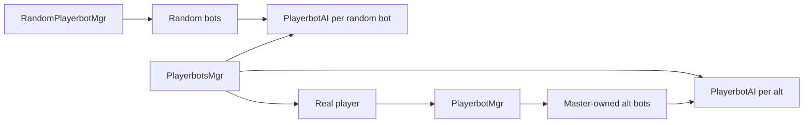

# Runtime lifecycle and threading

## Purpose

This page follows control from module load through bot login, updates, commands, and logout. It also records the thread and ownership boundaries that make these paths fragile.

## Registration and startup

### Script registration

```text
AzerothCore module loader
  -> Addmod_playerbotsScripts()
  -> AddPlayerbotsScripts()
  -> database, player, misc, server, world, playerbot, BG, and battlefield scripts
  -> command and secure-login scripts
  -> selected encounter scripts
```

Relevant sources:

- `src/Script/playerbots_loader.cpp`
- `AddPlayerbotsScripts()` in `src/Script/Playerbots.cpp`

`AddPlayerbotsScripts()` is the central registration list. A new AzerothCore script class has no effect until instantiated there or by a function called there.

### Database load

`PlayerbotsDatabaseScript::OnDatabasesLoading()` constructs a `DatabaseLoader` for `server.playerbots`, enables `DATABASE_PLAYERBOTS` updates according to `Playerbots.Updates.EnableDatabases`, and registers the `Playerbots` connection. The same script handles keep-alive, close, sync-query warnings, and revision reporting.

### World initialization

`PlayerbotsWorldScript::OnBeforeWorldInitialized()` calls:

1. `sPlayerbotAIConfig.Initialize()`
2. `PlayerbotSpellRepository::Instance().Initialize()`

`PlayerbotAIConfig::Initialize()` is broader than its name suggests. After reading options, it may create random bots, classify account types, initialize random-bot state, guilds and item caches, load BIS and text data, initialize `PlayerbotFactory`, build every shared AI context, load optional dungeon suggestions, and initialize travel.

Initialization order matters because later components assume earlier caches and registrations are complete.

## Owner model



### Bot categories

| Category | Holder | Master relation | Typical entry |
|---|---|---|---|
| Master-owned alt | The master's `PlayerbotMgr` | `PlayerbotAI::master` is the real player | `.playerbots bot add` or related command |
| Random bot | `RandomPlayerbotMgr` | Usually none; can temporarily follow a player | Population scheduler |
| Addclass bot | Classified account and allowed by holder checks | Controlled under addclass rules | Bot command and account classification |
| Self bot | Own AI and manager relationship | `GetMaster() == bot` | `initself` flow |
| Real player | Global manager entry only | Not a bot | Normal player login |

Do not infer category solely from the existence of a `PlayerbotAI`. Use established helpers such as `IsSelfBot`, random-bot checks, account types, and master relationship.

## Real player login

`PlayerbotsPlayerScript::OnPlayerLogin()` ignores bot sessions. For a real player it:

1. Calls `PlayerbotsMgr::AddPlayerbotData(player, false)`, which creates the player's `PlayerbotMgr`.
2. Calls `sRandomPlayerbotMgr.OnPlayerLogin(player)`.
3. Sends module and configured bot-count messages when applicable.

The global manager keeps separate GUID maps for `PlayerbotAI` and `PlayerbotMgr`. Their entries are deleted during player destruction through `PlayerbotsMiscScript::OnDestructPlayer()` and the corresponding destructors remove registry data.

## Bot login sequence

### Common asynchronous path

```text
command or random population event
  -> PlayerbotHolder::AddPlayerBot(guid, masterAccountId)
  -> ownership, capacity, and duplicate-loading checks
  -> PlayerbotLoginQueryHolder through CharacterDatabase
  -> completion callback creates bot WorldSession and loads player from DB
  -> queue OnBotLoginOperation
  -> world-thread processor executes operation
  -> PlayerbotHolder::OnBotLogin(bot)
  -> register PlayerbotAI and insert in holder map
  -> holder-specific OnBotLoginInternal(bot)
  -> optional queued group invite
```

Primary sources:

- `PlayerbotHolder::AddPlayerBot()` and `HandlePlayerBotLoginCallback()` in `src/Bot/PlayerbotMgr.cpp`
- `OnBotLoginOperation` in `src/Script/WorldThr/PlayerbotOperations.h`
- `PlayerbotHolder::OnBotLogin()` in `src/Bot/PlayerbotMgr.cpp`

### Duplicate protection

`PlayerbotHolder::botLoading` prevents two asynchronous attempts for one GUID. `BotInitGuard` separately protects factory initialization for one GUID. `PlayerbotHolder::OnBotLogin()` also rejects duplicate holder insertion. Preserve all three layers unless replacing them with a proven equivalent.

### Master-owned completion

`PlayerbotMgr::OnBotLoginInternal()` sets the `PlayerbotAI` master and resets strategies. Authorization before this point considers same-account, same-guild, linked-account, addclass, and random-bot rules plus configured maximums.

### Random-bot completion

`RandomPlayerbotMgr::UpdateAIInternal()` controls population. `AddRandomBots()` chooses classified accounts and characters, schedules the `add` event, and eventually calls the common login path with `masterAccountId == 0`. `RandomPlayerbotMgr::OnBotLoginInternal()` completes random-bot concerns such as guild and PvP state.

Account classification is stored in `playerbots_account_type`: 0 is unassigned, 1 is random bot, and 2 is addclass bot.

## Update paths

### Map-thread bot decision updates

`PlayerbotsPlayerScript::OnPlayerAfterUpdate(player, diff)` performs two lookups:

- If the player has a `PlayerbotAI`, call `PlayerbotAI::UpdateAI(diff)`.
- If the player has a `PlayerbotMgr`, call `PlayerbotMgr::UpdateAI(diff)`.

`PlayerbotAI::UpdateAI()` rejects missing sessions, out-of-world players, teleports, logout, and removal. It then performs bot-level maintenance and reaches `UpdateAIInternal()` and `DoNextAction()`.

This is the normal AI hot path. Avoid blocking I/O, synchronous database work, broad world scans, and shared-world mutation here.

### World-thread updates

`PlayerbotsWorldScript::OnUpdate(diff)` calls:

1. `PlayerbotWorldThreadProcessor::Update(diff)`
2. `sRandomPlayerbotMgr.UpdateAI(diff)`

The processor defaults to a 50 ms interval, a bounded FIFO queue, and batched execution. `PlayerbotOperation::GetPriority()` and a comparator exist, but the current processor stores operations in `std::queue` and does not apply that priority. Review both processor files before changing queue limits, ordering, or batch behavior.

Random-bot population, event expiration, and login or logout scheduling belong to this path.

### Session updates

Custom `PlayerbotScript` hooks call:

- `sRandomPlayerbotMgr.UpdateSessions()` for random bots
- `PlayerbotMgr::UpdateSessions()` for the specified master

`PlayerbotHolder::HandleBotPackets()` drains bot session packets and dispatches them through AzerothCore's opcode table. Session lifetime must be stable for the entire drain.

## World-thread operations

`PlayerbotWorldThreadProcessor` accepts `PlayerbotOperation` objects through a mutex-protected FIFO queue. Existing concrete operations cover:

- `GroupInviteOperation`, `GroupRemoveMemberOperation`, `GroupConvertToRaidOperation`, and `GroupSetLeaderOperation`
- `ArenaGroupFormationOperation`
- `BotLogoutGroupCleanupOperation` for group cleanup and persistence
- `AddPlayerBotOperation` and `OnBotLoginOperation` for login-related work

Inspect `src/Script/WorldThr/PlayerbotOperations.h` for constructor requirements and current use before adding another operation. A defined operation is not necessarily used by the active login path.

Use this pattern when an action running from a map update needs to mutate shared structures that the custom core expects on the world thread.

A queued operation must:

1. Carry stable identifiers such as GUIDs rather than trusting a delayed raw pointer.
2. Re-resolve objects and validate them in `IsValid()` or `Execute()`.
3. Have a meaningful name. Override priority only for API consistency because the current FIFO processor does not order by it.
4. Tolerate the player, bot, group, or session disappearing before execution.
5. Avoid unbounded work because the queue is shared by all bots.

The queue has a maximum size. Overflow can drop operations, so do not use it as an unlimited event log.

## Command ingress

### Chat and server commands

`playerbots_commandscript` in `src/Script/PlayerbotCommandScript.cpp` registers:

- `.playerbots bot` for holder commands
- `.playerbots rndbot` for random-bot administration
- Account key, link, list, and unlink commands

`PlayerbotHolder::HandlePlayerbotCommand()` and `ProcessBotCommand()` implement add, remove, initialize, list, lookup, and related operations.

### Bot-directed chat

Player chat hooks in `PlayerbotsPlayerScript` route whispers and group or guild chat to a recipient bot's `PlayerbotAI::HandleCommand()`. Exact message text can map to named actions or strategy changes. Preserve `PlayerbotSecurity` and chat filtering in command paths.

### Packet mirroring

`PlayerbotMgr` receives the master's incoming and outgoing packets and forwards supported events to owned bots and eligible random bots. `PlayerbotAI` has separate handler tables for:

- Master incoming packets
- Master outgoing packets
- Bot outgoing packets

Adding a packet handler requires registering an opcode-to-action name and ensuring that action exists in the relevant context and engine state.

### Remote command server

`PlayerbotCommandServer` can listen on the configured TCP port and route a request to `RandomPlayerbotMgr::HandleRemoteCommand()`, then to a bot AI. This path does not inherit normal chat command authorization. Treat listener exposure, parser changes, and new remote actions as security-sensitive.

## Logout and destruction

### Master logout

A master logout request can call `PlayerbotMgr::LogoutAllBots()`. The custom playerbot logout hook also logs out owned bots when appropriate and notifies `RandomPlayerbotMgr` that the player left.

### Bot logout

The common path in `PlayerbotHolder::LogoutPlayerBot()` coordinates:

1. Queued group cleanup and AI state persistence
2. Bot messages and holder-map removal
3. `WorldSession::LogoutPlayer(true)`
4. Session deletion

This path is lifetime-sensitive because player destruction, AI destruction, global registry erasure, map removal, and session teardown are linked but not represented by one RAII owner.

### Server shutdown

`PlayerbotsScript::OnPlayerbotLogoutBots()` calls `sRandomPlayerbotMgr.LogoutAllBots()`. New process-wide bot owners must be included in an orderly shutdown path.

### Secure login collision

`PlayerbotsSecureLogin.cpp` intercepts a real client login for a character already online as a bot. It attempts to log that character out through its master's holder, then falls back to the random holder. Changes must preserve the real player's ability to reclaim the character without leaving duplicate sessions.

## Thread and lifetime checklist

Before changing a runtime path, answer:

- Which hook invoked this code?
- Is it executing on a map thread, world thread, database callback path, session update, or command-server thread?
- Which object owns the bot at this point?
- Can the bot or master log out before delayed work executes?
- Is a raw pointer crossing a queue, callback, or tick boundary?
- Must the operation re-resolve by GUID?
- Can it run twice for the same GUID?
- Does failure leave `botLoading`, holder maps, global registries, groups, or sessions inconsistent?
- Does shutdown drain or safely abandon the work?

## Manual lifecycle verification matrix

At minimum, lifecycle changes should exercise:

| Scenario | Expected observation |
|---|---|
| Add an offline same-account alt | One login, one holder entry, AI initialized, optional group invite |
| Repeat add while loading | Duplicate request rejected without a stuck loading entry |
| Remove an active alt | Group cleanup, state save, session logout, registry cleanup |
| Real client reclaims online bot character | Bot session leaves before real login completes |
| Random population increase and decrease | Counts converge without login storms or stranded sessions |
| Master logs out during bot activity | Owned bots leave cleanly and random followers lose master safely |
| Server shutdown with active bots | All bot sessions close without queue or map lifetime failures |
